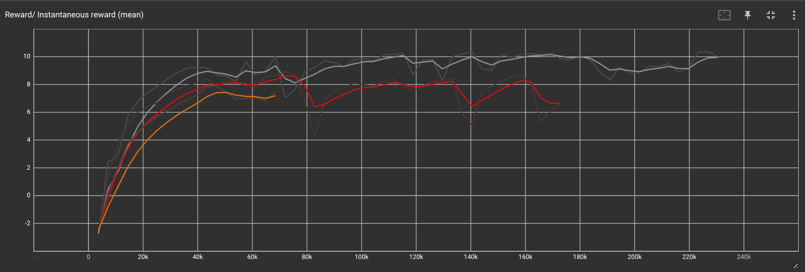
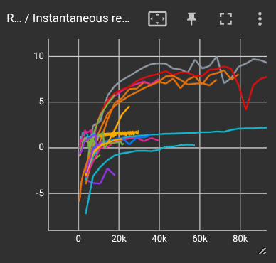
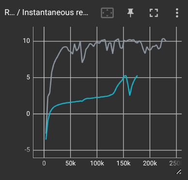
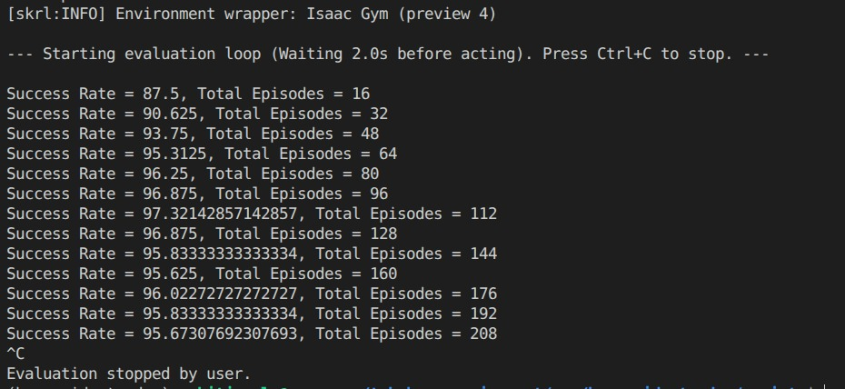
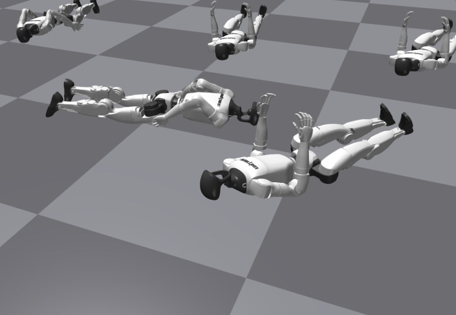

## Summary 
 
**Problem Chosen:** Humanoid Standup from arbitrary pose.  
**Robot morphology:** Unitree G1  
**Controls Approach:** RL  

**Result:** Robots can stand up from any random orientation on the ground with a ~93% success rate.  
The policy is still explosive and jerky (definitely not safe for deployment), but can be made better with further reward shaping and tuning. (Unable to tune completely due to long training time on current hardware, making feedback and evaluation loops very long)  
Trying to improve further : )

<!-- <video src="./media/g1_standup.mp4" width="100%" controls autoplay muted loop> -->

https://github.com/user-attachments/assets/cd6c00d5-78da-4c3c-9ac0-7fe49493358a

## Problem Statement

- **Problem Chosen - Humanoid Standup from arbitrary pose.**
    - Ofc I had to, I'm applying for the Optimus team : )
    - Other options I'd considered:
        - Quadrotor flight through window (similar to past work with Crazyflie)
        - Self-balancing bicycle (a long-standing personal interest)
        - Double pendulum swingup and balance (chaotic system)
        - Ball on plate balancing with trajectory tracking (fun if actual hardware project)

- **Robot morphology - Unitree G1** 
    - The go-to is the Mujoco humanoids, but I wanted to take up this task on a realistic robot, and Unitree G1 is a pretty popular one, and plus I've worked with this one before.

- **Controls Approach - RL** 
    - Just based on first view, this problem is built for RL. I can't really fathom a traditional controls method due to the incredibly non-linear, contact-rich dynamics at play. Even if I did painstakingly write down one (some complex non-linear trajectory optimization, or some discretize-linearize and store shenanigans), I think it certainly wouldn't converge in time, let alone run in real time (certainly not with my hardware, most probably not with any hardware).

## Literature Review

- Gymnasium Humanoid StandUp Env
    - [Project Page](https://gymnasium.farama.org/environments/mujoco/humanoid_standup/) 
    - My go to thought was first checking the standard gym/gymnasium enironment on human standup. They actually use direct torque action space, and provide a much stronger observation space consisting of mass and inertial components, as well as constraint and external forces on each link in aaddition to standard proprioceptive information. With respect to rewards, they simply provide a reward propotional to the z co-cordinate of the base along with actuaion and impact penalties. Surprisngly enough, although being part of a very standard library, I couldn't find many solutions posted to this particular environment, and the ones posted looked barely functional, implying this might not be a good setup to actually reference from.

- MujocoMPC
    - [Project Page](https://github.com/google-deepmind/mujoco_mpc#overview)
    - When later working on the project, I remembered I actually had come across MujocMPC before, a rare traditional controls approach that levergaes various sampling based and first-gradient based optimizers to optimize for a trajectory formulating it as model predictive control, and using the mujoco sim itself as it's predictive model. This definitely is an very interesting approach, but requires highly performant C code to run real time, and I also remember it had a few weird shenanigans related to slowing down the sim to allow the solvers to converge dynamically.
       
- HOST (Humanoid Standing-up Control)
    -  [Project Page](https://taohuang13.github.io/humanoid-standingup.github.io/) 
    - This is one of the only papers that has show actuall hardware implementation of humanoid standup. They also formulate as an RL problem, passing standard proprioceptive information and predictiting joint PD targets. They use task rewards relating to head height and roto orientation, and also provide a lot of custom shaped style and regularization rewards, as well as a post-task reward to enable continued standing up. They also mention of changing reward formulation for 3 stages - righting, kneeling, rising, and using multiple critics and a curriculum based external upward helping force to enable the policy to learn.
    - The references to the above further paper also shed on some previous approaches
        - A lot of older tradtional aproaches worked on specific stages contact-stages and used specific designed stand-up routines. Designing such a static method won't be dynamically reactive and depend on the tediousness of the controller hand design,
        - A few papers such as DeepMimic, AMP, ASE, etc in graphics demonstrate learning to stand up via imitating to track human reference motion. However, these approaches limit the robot to get up only in ways that humans would, which feels particularly limiting.

- HumandUP (Learning Getting-Up Policies for Real-World Humanoid Robots)
    - [Project Page](https://humanoid-getup.github.io/)
    - A similar approach of formulating as an RL policy, but they divide the task into two stages: rolling over and then standing up. They perform significant and tedious curriculum training to slowly transform the policy to be able to deployed sim-2-real. For the stand-up, the use height reward, delta height rewards, upright orientation rewards as well as foot contact, foot contact forces and symmetry rewards. This in not a single controller as requested, and also is amde to stand up from a particular configration only.

## Problem Formulation

The control task is formulated as a Markov Decision Process (MDP), where a reinforcement learning policy $\pi$ maps current states $\mathcal{S}$ to actions $\mathcal{A}$ to maximize the expected cumulative reward over time.

- **Observation Space:**  
    - **base_lin_vel_local** = base linear velocity in local frame (3 dim)
    - **base_ang_vel_local** = base angular velocity in local frame (3 dim)
    - **projected_gravity** = unit vector representing gravity vector in local frame (3 dim)
    - **delta_dof_pos** = difference between current joint positions and a set default joint position (23 dim)
    - **dof_vel** = current joint velocities (23 dim)
    - **past_actions** = actions taken in last step (23 dim)

- **Action Space:**
    - **target_delta_dof_pos** = actions are scaled and added to default joint positions to obtain final joint PD targets (23 dim)

- **Reward Design:**
    - **standup_reward** = primary objective driving the base to stand up. Cosists of 2 main  components, a clamped target height fraction component, and another upright component rewarding the upright orientation proportional to the z value of projected gravity. The 2 components are multiplied together so that high rewards can only be acheived after both are simulatneously satisfied (You you get policies sitting upring on the ground, or with the pelvis lifted but body slumped over).
    - **pose_reward** = exponential penalty on joint deviations from the default standing posture. This is scaled by the height fraction component to enfore this strongly once it has stood up a decent amount (as we do not want to enforce this early on, where diferrent movements are required to get up in the first place). This reward is important as it provides a feedback signalsucesfully standing up to continue to balance near deault position. 
    - **action_rate_penalty** = penalizes the squared difference between consecutive actions to minimize high-frequency hardware chatter and promote action consistency.
    - **dof_vel_penalty** = penalizes squared joint velocities to promote smoother, energy-efficient stabilization. Note that usually one can penalize join torques as well, however for the stand up task, we require high torques to actually get up, and hence dof velocity is a better regulairizer. 

    - Other variations = I tried a lot more reward formulations, varying their implementation, their scales as well as other reward components such as rewards related to penalizing base z velocity to prevent jumping, penalizing base angular velocities to prevent excessive rotations, rewarding feet contact and contact forces, and a lot more. However, the above 4 seem to matter the most and have the most impact.

- **Initial State Distribution:**
    - I go ahead with the naive approach of spawning the robot in the air at some fixed height of 1.5m (>> robot height) in a random orientation and random pose. The robot falls to the ground due to gravity, and I hope most possible and plausible configurations will be covered over this randomness. I understand that the few seconds dropping in feels detrimental to the policy rollout collection, however, there's a possibility similar states might be observed later in the process while getting up, and this should aid in exploration slightly. Also, in a few cases, the robot might spawn in a near-standing orientation and remain standing after being dropped. These cases shall also aid in learning to balance on its feet early on, and also serve as good desired positive samples in the buffer to let the critic know what a good state looks like. Also, dropping high from the air leads to realistic fall situations, and we can also bypass the FK check to determine the actual height to spawn the robot to prevent clipping with the ground if trying any other specific initialization method.

- **Transition Function:**
    - Based on the given actions and current state, the transition function is simply the simulator's step function, which provides the next states. The only change I make here is to truncate/reset the state every 5 seconds as well to ensure we get diverse rollouts.

- **Assumptions:**
    - Flat terrain - Robots will attempt to stand up on completely flat ground. (I know for a fact my laptop can't handle terrain well)
    - Rigid-body assumption - Rigid body simulation of links shall suffice to capture the stand-up phenomenon. (Realistically, the robot hands and feet should/might have some compliant materials, but simulations for those are time-consuming, and unsuitable for RL). Further, I used physical steps of 0.005 seconds or 200 Hz, hoping the intricacies of physics and contact are sufficiently accurately captured in this time frame/frequency.
    - Simplified collision mesh - The solver uses a simplified collision mesh to enable faster simulation. I know for a fact that in my case, the foot is modelled/simulated as a point plane. 
    - No self-collision - Sadly, enabling self-collision even on this simplified mesh slowed down simulation by a lot, and hence I had to turn off self-collision to enable training. 
    - Ideal actuation - I'm assuming an ideal PD controller takes in the policy's outputs. (Actuators in real life are hardly ideal and linear, but with proper design and tuning, they should act like one at least in a certain range)
    - Zero latency - I'm assuming the states are populated exactly for ease of implementation. (Realistically, this is rarely the case and every sensor will have some inherent latency due to the communication channels)
    - Perfect state estimation - I'm assuming I shall get perfect states every timestep. (Usually, there is sensor noise that should be modelled in, and also a few derived terms, such as base_linear_velocity, which are further worse)

## Implementation Details

- **Design Philosophy**
    - I appreciate simplicity, and try to build up over the most minimal setup, and eventually scale up/introduce complexity if and when these simple methods fail. It feels weird to directly jump to a complex approach without knowing if it's actually required.

- **Infrastructure & Software Stack**
    - Simulator - IsaacGym
        - For RL, we need a GPU-accelerated vectorized simulator for scaled, fast rollout collections. Did not go ahead with Mujoco MJX as it requires interfacing with JAX and FLAX for learning, and I'm unfamiliar with both currently. Did not choose IsaacLab, as the Omniverse software it loads with is too heavy (an empty scene itself takes 2-4 GBs of VRAM). IsaacGym is a deprecated predecessor, but is lightweight and fast enough to run and train policies on my laptop 4070. 

    - RL Library - skrl/PPO
        - I was initially thinking of rsl_rl, since I've worked with it the most. However, the version compatible with IsaacGym (requires python<=3.8) is pretty old. And anyways, since the assessment didn't have a deadline, I thought I might as well learn and experiment with a more general, modular, and well-documented library in skrl. Further, IsaacLab RL library benchmarks show skrl is comparable with rsl_rl in terms of performance. 

    - Project Structure
        - The structuring is heavily inspired by the legged_gym repo. I use 'uv' for python dependency management and a reproducible setup, and structured the repo like a package. 'Omegaconf' is used for CLI config management while setting up training, while 'tensorboard' is used for logging and visualizations during training. The repo is organized simply with separate folders for separate components such as assets, configs, envs, models, scripts, etc. Go over the README for exact commands to set up and run this repo.

    - Compute 
        - I did all experiments locally on my laptop with Nvidia 4070.

- **Robot and Actuation**
    - Robot URDF - Official Unitree G1 23-DOF latest urdf
        - These are provided by the manufacturer, Unitree themselves. They offer a 29 DOF version as well, however out of the extra 6 joints 2 correspond to extra rotational DOFs at the waist, and 2 for additional flexibility at the wrist on each hand. The extra waist DOFs seem like they might be important to the stand-up task, while the wrists might not have as much impact. Anyways, my plan was to start with 23 DOF to see if it would suffice (which it did), and later possibly test the 29 DOF version if required. This also helped me reduce the state space and action space dimensionality, allowing me to train faster converging and exploring policies.  

    - Control Frequency 
        - While I use a physics timestep/frequency of 0.005 seconds/200 Hz, I use a decimation of 4. This makes it so that 4 physics steps are called in between policy inferences, which makes the control timestep/frequency 0.02 sec/50 Hz. This is done so that the PD controller has time to actually follow the commands, and it models real-life deployment where the on-board internal PD controller runs at 1000s of Hertz while the policy is inferenced at a much slower frequency.

- **Model and Policy**
    - Architecture
        - I use simple 512-256-128 hidden layer MLPs for my actor and critic networks with ELU activations to prevent dead neurons and vanishing gradients. These usually suffice for typical locomotion tasks, and I expect them to be enough here as well. If I hadn't seen much progress, I would've tried larger networks/different architectures.
    
    - Policy
        - I tried to set up my PPO hyperparameters as closely as those used in the legged_gym repo, as these have proven to work for a range of robot tasks in the past.

## Results

- **Training** 
    - Training Time
        - The task turned out to be much harder than expected. Since simpler locomotion tasks train in about 20-30 minutes, I expected standup to take around 1hr. However, the policies had to train a lot longer, 3-5 hours, before getting some meaningful behavior that resembles standing up.

    - Convergence
        - I have to admit the training is not the most stable, but most policies do seem to somewhat converge after the 4-5 hour mark. This convergence is not as stable, as we can see in the image below that the reward still keeps fluctuating and varying significantly, as the policy might be alternating between some local optima. Further, training runs with almost similar parameters do not necessarily converge to similar reward curves, and slight changes in reward structuring also led to significantly diverging behaviors, implying the training is still not completely stable. (Note - I've just shown 3 curves here that were obtained with somewhat stable settings. But over the many experiments and tweaks I've performed, I've seen greatly diverging behaviors in reward curves, sometimes even complete collapse).

        

        
         
        <em>Reward curves across 3 runs with similar rewards and parameters</em>
        

        

        
         
        <em>Just a glimpse of the variability in rewards with slight tweaking of rreward terms</em>
        

    - Scaling
        - In locomotion tasks, I usually am able to learn with just 1024 environments. However, with standup, scaling did play a very important role, and I had to use 8192 environments to see progress in meaningful time. As you can see in the figure below, scaling the number of environments down in attempts to speed up simulation and save on VRAM to run multiple experiments in parallel led to a significant drop in learning/convergence rates.

        

        
         
        <em>Grey curve = 8192 num_envs, Blue curve = 2048 num_envs</em>
        

- **Policy video**
    - I trained mutiple versions, and am pasting the videos of rollouts of one that I feel were on the better side.

    - Rollout during eval -
      
      https://github.com/user-attachments/assets/cd6c00d5-78da-4c3c-9ac0-7fe49493358a
      
    <!-- <video src="./media/g1_standup.mp4" width="100%" controls autoplay muted loop> -->

    - Rollout during training (rendering colission mesh, which is faster than rednering full mesh) 
    
      https://github.com/user-attachments/assets/92a47bdd-9ede-40dd-9baa-8122c19dac45
      
    <!-- <video src="./media/g1_standup_collisionMesh.mp4" width="100%" controls autoplay muted loop> -->

- **Behavior**
    - I completely understand that while the task is being done successfully, this behavior is far from being able to be deployed safely. However, I believe now that we've gotten the rewards structure to at least get the policy to the local minima of behavior we desire, we should be able to further tune and do minor reward shaping to get deployable policies.
    - Also note that the jerky and sudden twisting movement might not feel realistic (and safe), and I do certainly feel the same as well. But then I'm reminded of this [impressive video from Unitree](https://youtu.be/bPSLMX_V38E?si=RPir0-ib2z6du7Kb), which shows that the hardware is actually capable of some insanely fast and dynamic and twisted stand-up motions that feel icky to watch, even in real life. And hence, while it feels wrong, it just might, might be possible : )

- **Evaluation**
    - The policy was trained with robots resetting falling in the air. This is not from a grounded pose as mentioned in the problem statement exactly. To evaluate the policy on these exact situations, during my eval, I send 0 actions for the first 2 seconds, allowing the policy to fall on the ground stationarily (as would be in the problem statement), and then start inference of my policy. I measured success by checking if the robot had reached 80% of the required target root height and required upright orientation at the end of the episode. With this evaluation metric, the policy was able to successfully stand up 93% of the time over ~200 episodes. I've noticed the policy struggles slightly with the face down pose, however most land face up.

    

    
     
    <em>A snapshot of the success rate output of the eval process</em>
    

    

## Limitations and Improvements

- **Self Collision:** One of the major limitations is, of course, having self-collision disabled to enable training on limited compute. And while most of the motion is actually collision-free on basic visual inspection, it's just a simple switch to turn on for someone with enough compute, which might otherwise have very undesirable consequences.

- **Privileged Info:** While most observations are actually proprioception-based and extremely achievable in real hardware deployment, `base_lin_vel`, i.e., linear velocity of the base, is not readily available, and has to be obtained via mocap or some complex estimation. We should, of course, try the standard routes of removing this privileged information from the states, and using asymmetric actor-critics or just passing some sliding window history of observations directly to the model (or through some explicitly trained temporal CNN module in a supervised manner), and hope that the privileged info can be approximated through this history of other observations. (One could theoretically go into figuring out if it's possible and the history length required for the property to be observable through the history, but the dynamics are going to be so complicated, I'd just throw data at it and pray that it works : )

- **Improve Evaluation:** While my evaluation is random, I had thought of a more complicated structure where an array of robots are actually carefully spawned along the ground in some flat/T-pose like joint configuration with every possible discretized rotation (i.e., face-up, face-down, on-the-side, etc.). With a good enough resolution of discretization, we could visibly pinpoint the "boundary" of initial configurations from which the robot fails and determine more details. To determine the exact fail cases, I can also try and train and multiple adverserial agents to explicitly hone in on the local failure cases of the current RL controller.

- **Random Pose Eval?:** One thing I actually noted was that in my eval implementation, even if I send 0 actions, the internal PD controller is still trying to maintain the default position. Note that this is not that bad, and one could implement a similar protocol in real life, where once fallen, the robot actually initially attempts to PD track some default joint configurations. However, this implies by the time the robot falls on the ground, it no longer actually maintains the random joint configuration I spawned it with, but mostly the default configuration. And note that this is not bad. I verified that under this protocol/controller, the robot actually ends up having 2 physically stable configurations in which it can lie down - i.e., face-up and face-down (as shown in the image below); the configs that land sideways just end up turning face-up under this simple PD controller as it is physically stabler. This helps reduce uncertainty / automatically causes the robot to converge on one of these stable positions, reducing the requirements of the controller to actually deal with arbitrary poses. Of course, the policy has learned to even output actions during the fall to shift towards optimal outcomes for standup during training, and it should still be able to deal with random poses. 

 
<em>We see most robots after falling either end up in face-up or face-down states (even if they fall on their side)</em>

- **"Jumpy" Behavior:** The current reward structure sometimes encourages the robot to 'jump' up instead of stably moving on its feet. I'm sure this can simply be fixed by shaping some feet contact/force, or even shaping the stand reward a bit more appropriately. But with limited compute and time, I leave it for another day. 

- **Unstable Behavior:** I've noticed, that the policy, especially when trying to stand up from face down, can sometimes get stuck in a buckled legs state. This is also seen in some cases when the robot is standing up unstably leaning backwards. I can try and improve this behaviour by performing weighted spawning, explicitly prefering spawning face down for some percent of the robots to increase the experience the policy has seen in this failure case. There is always a possibilty that if we allow the policy to train further, it'll start encountering such long-tail failure cases more and evetually learn to stabilize these as well.

- **Training Imrpvoements:** as mentioned, the training is not the most stable and kind of twitchy and highly sensitive to the reward structuring and randomness at times. I can improve this by introducing much better curicullum learning, where I can assist the robot with external forces, or spawn in gradually worsening states. However due to limited compute, training even once is a big time investment, and implementing curicullum and narrowing down tuning for this as well will take much much longer.

- *Get more compute!!! haha*

## AI Tool use
- I truly beleive LLM's to be usefull tools, like a calculator, and have certainly used AI assistance in rephrasing documentation, as well as writing code and navigating the dependency hell of using a deprecated simulator. 
- That being said, I don not enjoy or prefer agentic coding where I just prompt and sit back as in my past trials with this, firstly it wasn't that good (I'm using the free tiers, hehe), debugging was a much larger pain due to the black box nature, and it's also a lot more time consuming with no way to speed up, and it also feels bad to rely on the tool this heavily.
- Hence I prefer using AI the "older way", having discussions with it regarding literature surveys and architechtural decisions, analyzing and deciding on frameworks myself, and then start writing code from scratch, while ofc taking assistance of LLM's for well-defined snippets of code where required to speed up the repetetive stuff as well as understand and optimize my own implementations.
